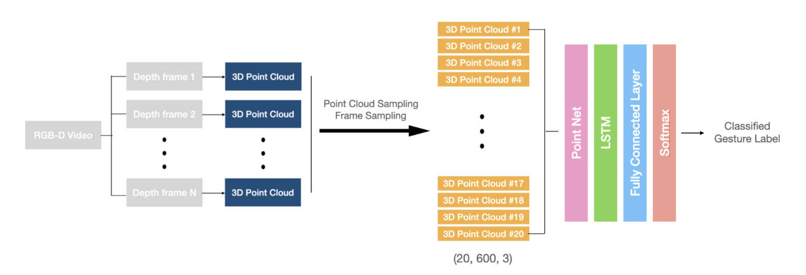
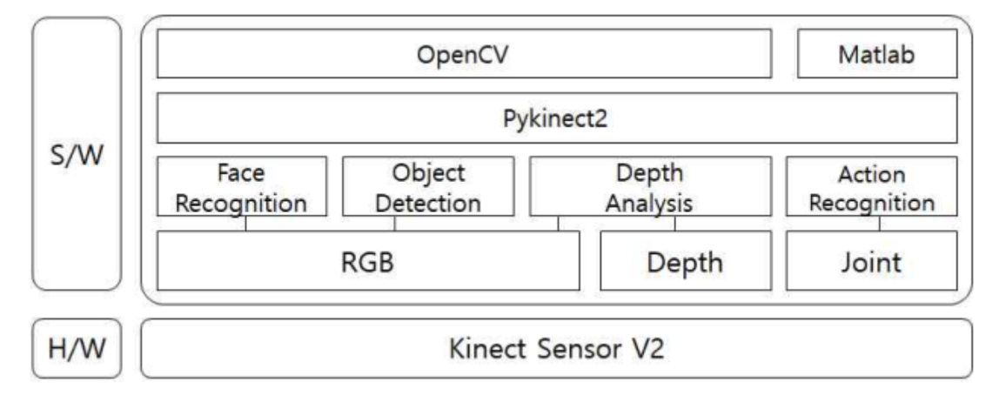
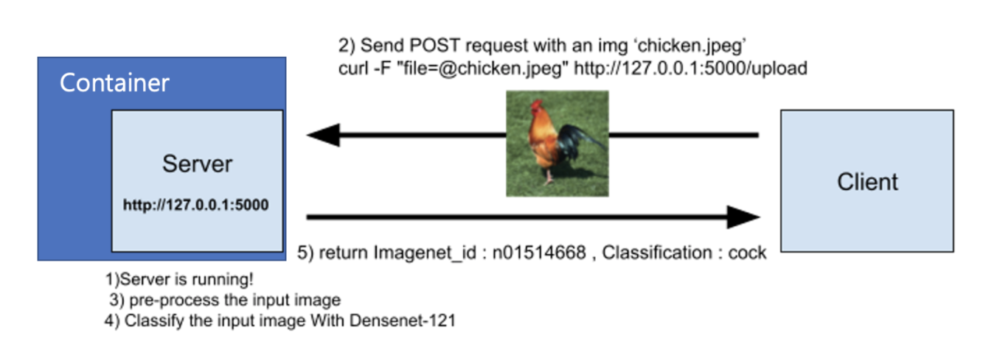
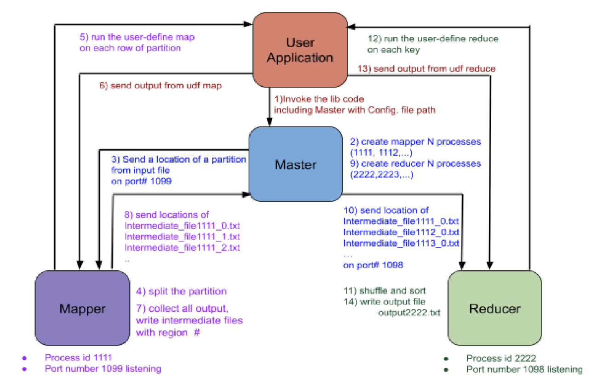

# Portfolio
---
## Computer Vision

### Data Science for Common Good

Built an end-to-end platform to automate the detection and counting of herring fish species moving upstream in image and video data for efficient fishery management.

 

---
### 4D Hand Gesture Recognition using Point Set

Proposed PointNet & LSTM based 4D Hand Gesture Recognition approach and trained it with 3D Point Cloud dataset which are generated from the raw video data. Achieved 84.28% test accuracy for the 14 gestures classification task.

---
### REAL:TELLER

Developed a life-supportive real-time service for the blind to perceive indoor situations with the situation-aware technology. Implemented the system which can recognize objects and each locations, human faces with each actions (still, sit, walk and drink).

---
## Machine Learning

### Emotional Sentiment Classification using CNN

Proposed and implemented a simple 1D-CNN architecture to classify emotional sentiment based on EEG brainwave data. Achieved 97% accuracy on test set and improved into 98.13% test accuracy with additional feature selection method.

 

---
### ML Inference

Developed image classification model serving program where a Docker container is built to use Densenet-121 model for inference and image query requests are handled by Flask.

---
## Natural Language Processing

### Token Level Classification for Argument Mining

Focused on modeling for the task of argumentative and rhetorical elements segmentation, adopting multitask learning approach, and explored the behavior of our proposed deep learning workflow which outperformed the baseline as well as achieved considerable token-level accuracy of 70.58%.

 

---
## Software Engineering

### MapReduce Program

Developed our own MapReduce library code which runs on a single server, but mimics the behavior of a distributed multi-process implementation via RMI and also tolerates worker servers' failure by throwing RemoteException. The program has a master-slave architecture where the master controls and distributes th work, and the slaves work as mappers or reducers.

---
## Data Science

### Pharmacy ESQL Project

Implemented functionality to provide appropriate dataset with regard to user’s status, either doctor or patient, and utilized the same dataset to console applications by linking the program through PHP, SQL and C++.

 

